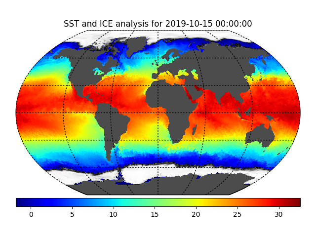
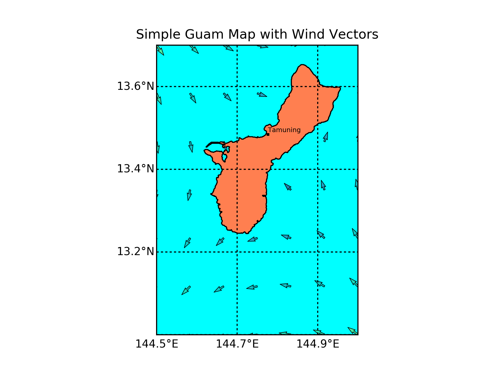

Plots for Oceanographers
=================================

Sea-surface temperature and Ice
*******************************************************

URL to the data::

    'http://www.ncdc.noaa.gov/thredds/dodsC/OisstBase/NetCDF/AVHRR/201910/avhrr-only-v2.20191015.nc'

Guam with plot of wind vectors
+++++++++++++++++++++++++++++++

The wind vectors are random, physically meaningless.

